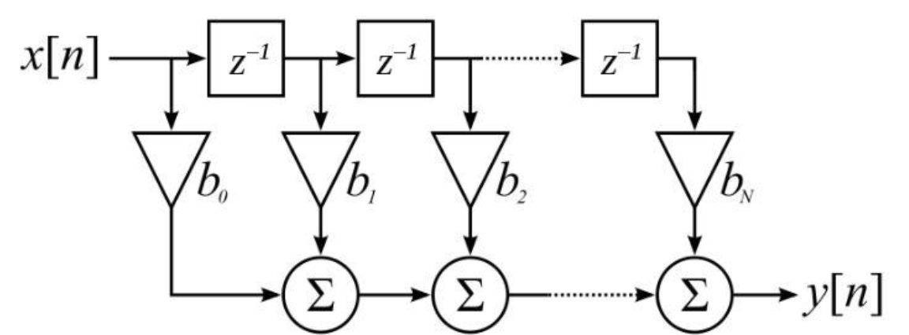
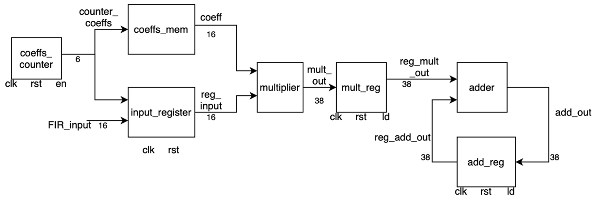
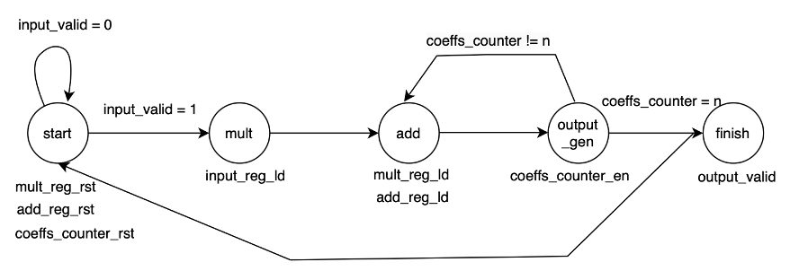
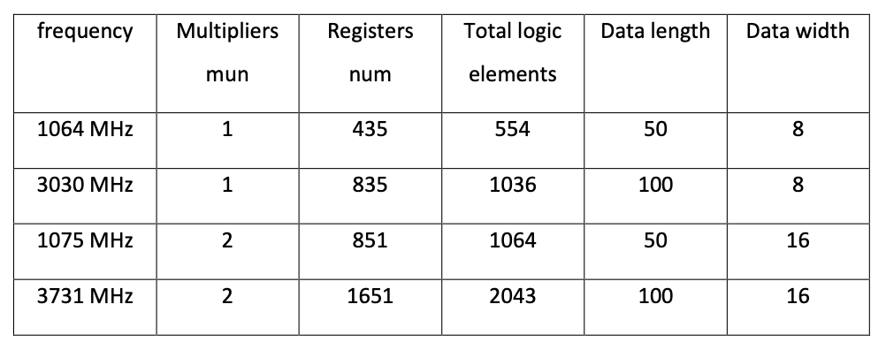

# FIR Filter Design and Implementation
This project implements a Finite Impulse Response (FIR) filter with configurable parameters using Verilog. The design includes both the datapath and controller components, built to handle variable filter sizes and ensure accurate results through extensive validation methods.

**Datapath Design:**
The datapath is shown in following figure, the coefficients (coeffs) are stored in memory. The inputs are also stored sequentially in the input_register module, with the most recent input placed in the zeroth position of the module. A counter is used to specify the index of the coefficient and input. A multiplier is used to calculate the product of each coefficient and input. Additionally, a register is placed after the multiplier, serving a pipelining function. Following that, an adder module is used to sum up the products calculated in the previous steps.

**Controller:** 
In the controller unit, at the start, we reset the registers and counter, then wait until the input_valid signal becomes active. When this happens, we proceed to the next state (mult) to perform multiplication, loading the input from the input_register module. After this, we move to the addition stage, where we load the pipeline and addition registers. In the following stage, where the output is calculated, we increment the counter by one. We repeat this process until the counter reaches the specified n value. Once this condition is met, we move to the final stage and activate the output_valid signal.

**Note that the design has been tested using assertions. The assertion testbench code can be found in the codes folder.**

The design has been synthesized with various data widths and data lengths. Key synthesis results are summarized in the table below:

